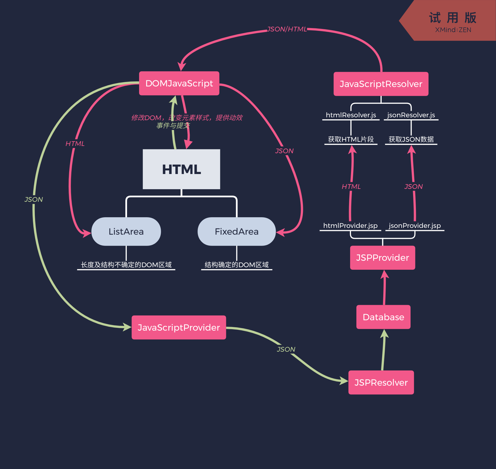
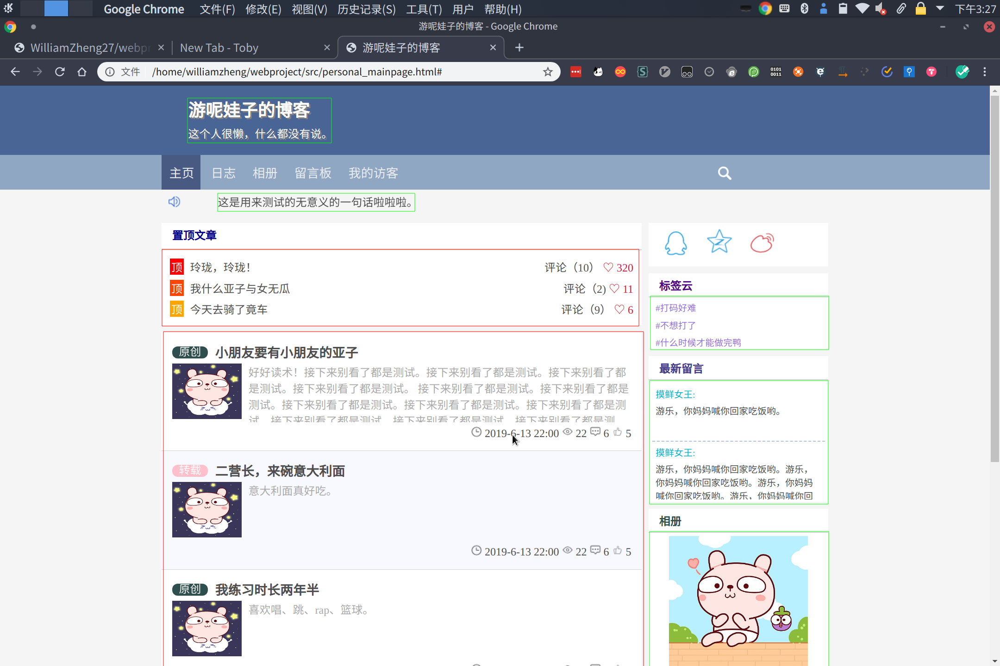

# 接口文档

## 整体架构

### 架构图

### 页面结构

- 红框：动态加载(填入HTML)
- 绿框：静态加载(预编写HTML，填写内容)

###　命名规范

#### HTML/CSS

全部小写，单词之间使用-连接

例：col-mid-8

#### JavaScript变量

驼峰命名，例：articleObj

## 前端接口定义

### DOM(DOM.js)

#### 主页(class Mainpage)

##### loadTop()

获取置顶文章

##### loadTag()

获取标签云

##### loadMore()

获取更多日志

##### goShare(s)

s：enum{"qzone","sina","qq"}

分享方法

#### 日志列表

#### 日志

#### 相册列表

#### 相册

### 获取

### 上传

## 后端接口定义

### 模板(/templates)

#### 主页日志列表(/templates/mainpage_article_list.jsp)

##### Request

- mode：获取模式
  - 0：获取全部日志
  - 1：从第from篇获取count篇
  - 2：获取标题含有topic字符串的日志(from和count依然有效)
- from (not required in mode 0)
- count (not required in mode 0)
- topic(mode 2 only)

##### Response

HTML内容

### 日志

### 照片

## 数据库定义

## 附录：URI

 